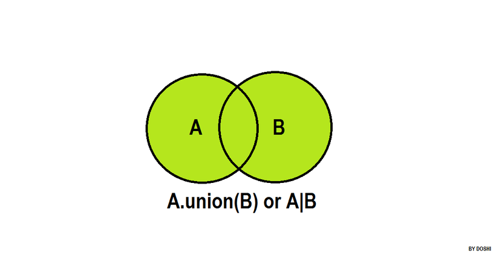
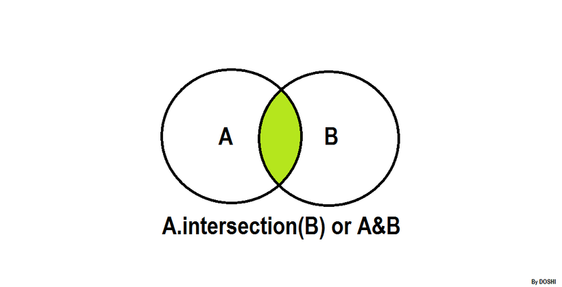
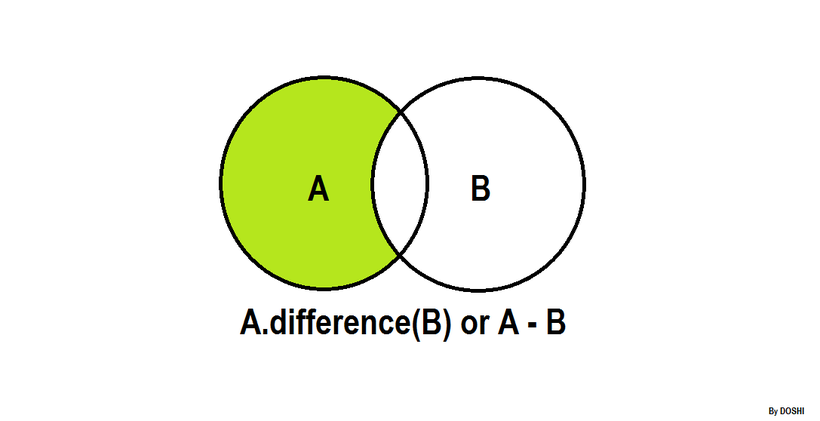
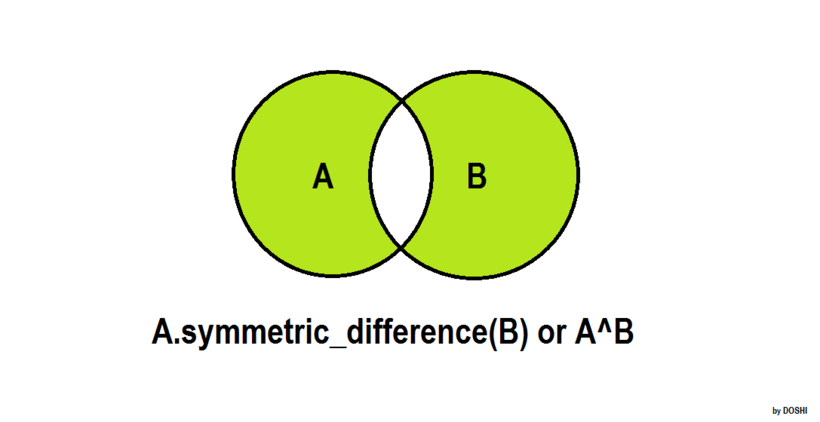

## 01 introduction to sets
https://www.hackerrank.com/challenges/py-introduction-to-sets/problem

## 02 set .add()
https://www.hackerrank.com/challenges/py-set-add/problem

## 03 set .discard(), .remove() & .pop()
https://www.hackerrank.com/challenges/py-set-discard-remove-pop/problem

## 04 set .union() Operation
https://www.hackerrank.com/challenges/py-set-union/problem

## 05 set .intersection() Operation
https://www.hackerrank.com/challenges/py-set-intersection-operation/problem

## 06 set .difference() Operation
https://www.hackerrank.com/challenges/py-set-difference-operation/problem

## 07 set .symmetric_difference() Operation
https://www.hackerrank.com/challenges/py-set-symmetric-difference-operation/problem

## 08 Symmetric Differences
https://www.hackerrank.com/challenges/symmetric-difference/problem

## 09 set mutations
https://www.hackerrank.com/challenges/py-set-mutations/problem

## 10 check subset
https://www.hackerrank.com/challenges/py-check-subset/problem

## 11 check strict superset
https://www.hackerrank.com/challenges/py-check-strict-superset/problem

## 12 the captain's room
https://www.hackerrank.com/challenges/py-the-captains-room/problem
